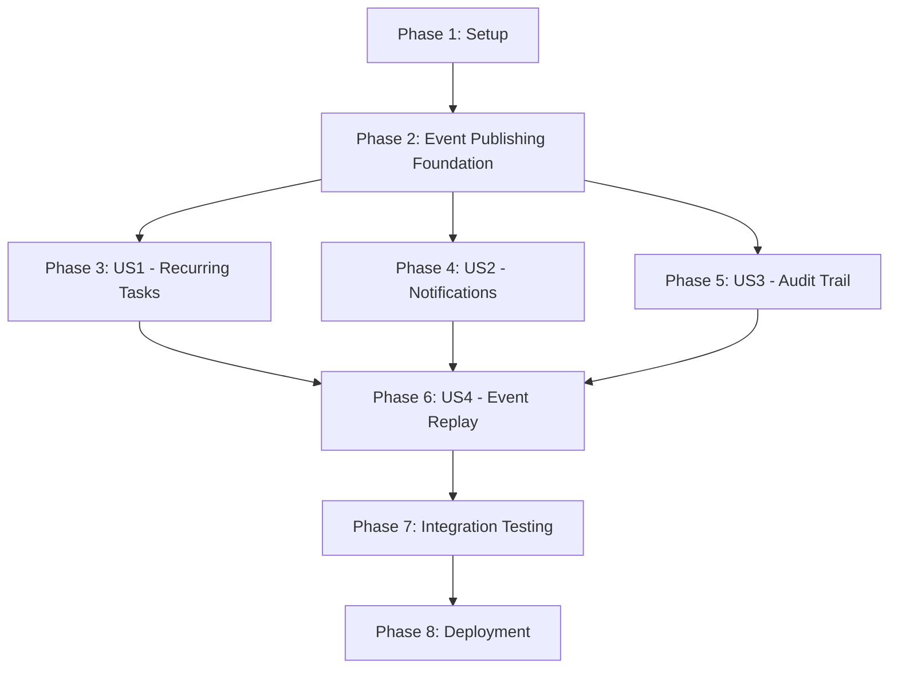

# Implementation Tasks: Event-Driven Architecture with Kafka

**Branch**: `011-kafka-event-architecture` | **Date**: 2026-01-12 | **Spec**: [spec.md](spec.md) | **Plan**: [plan.md](plan.md)

## Task Breakdown

### Phase 1: Setup and Infrastructure (Prerequisites)

#### Dependencies and Environment
- [ ] **T001** [P] Install aiokafka library in backend requirements (backend/requirements.txt)
- [ ] **T002** [P] Install pywebpush library in backend requirements (backend/requirements.txt)
- [ ] **T003** [P] Install pytest-asyncio for async testing (backend/requirements.txt)
- [ ] **T004** [P] Install testcontainers-python for Kafka integration tests (backend/requirements.txt)
- [ ] **T005** Add Kafka bootstrap servers to environment configuration (backend/.env.example, backend/app/config.py)
- [ ] **T006** Add VAPID keys configuration for Web Push notifications (backend/.env.example, backend/app/config.py)
- [ ] **T007** Create Docker Compose configuration for local Redpanda instance (docker-compose-kafka.yml)

#### Database Schema Extensions
- [ ] **T008** Create audit_logs table migration with event_id, timestamp, user_id, task_id, operation_type, event_payload columns (backend/migrations/)
- [ ] **T009** Add indexes on audit_logs for task_id, user_id, timestamp, operation_type (backend/migrations/)
- [ ] **T010** Add unique constraint to tasks table for recurring instance deduplication (backend/migrations/)
- [ ] **T011** Create notification_subscriptions table for Web Push endpoints (backend/migrations/)
- [ ] **T012** Run database migrations and verify schema (backend/apply_migration.py)

#### Microservices Project Structure
- [ ] **T013** [P] Create services/recurring-task-service directory structure (services/recurring-task-service/)
- [ ] **T014** [P] Create services/notification-service directory structure (services/notification-service/)
- [ ] **T015** [P] Create services/audit-service directory structure (services/audit-service/)
- [ ] **T016** [P] Create requirements.txt for recurring-task-service (services/recurring-task-service/requirements.txt)
- [ ] **T017** [P] Create requirements.txt for notification-service (services/notification-service/requirements.txt)
- [ ] **T018** [P] Create requirements.txt for audit-service (services/audit-service/requirements.txt)
- [ ] **T019** [P] Create Dockerfile for recurring-task-service (services/recurring-task-service/Dockerfile)
- [ ] **T020** [P] Create Dockerfile for notification-service (services/notification-service/Dockerfile)
- [ ] **T021** [P] Create Dockerfile for audit-service (services/audit-service/Dockerfile)

### Phase 2: Event Publishing Foundation

#### Kafka Producer Service
- [ ] **T022** Create Kafka producer module with startup/shutdown lifecycle (backend/app/services/kafka_producer.py)
- [ ] **T023** Implement async event publishing with error handling and retries (backend/app/services/kafka_producer.py)
- [ ] **T024** Add event schema validation using Pydantic models (backend/app/schemas/events.py)
- [ ] **T025** Implement UUID event ID generation (backend/app/services/kafka_producer.py)
- [ ] **T026** Add producer health check endpoint (backend/app/routes/health.py)
- [ ] **T027** Add producer metrics collection (publish count, errors, latency) (backend/app/services/kafka_producer.py)
- [ ] **T028** Integrate producer startup in FastAPI lifecycle events (backend/app/main.py)
- [ ] **T029** Write unit tests for Kafka producer service (backend/tests/test_kafka_producer.py)

#### Event Schema Definitions
- [ ] **T030** [P] Define TaskEventSchema Pydantic model (backend/app/schemas/events.py)
- [ ] **T031** [P] Define ReminderEventSchema Pydantic model (backend/app/schemas/events.py)
- [ ] **T032** [P] Define TaskUpdateEventSchema Pydantic model (backend/app/schemas/events.py)
- [ ] **T033** Add JSON Schema files for event validation (specs/011-kafka-event-architecture/contracts/)
- [ ] **T034** Write schema validation tests (backend/tests/test_event_schemas.py)

### Phase 3: User Story 1 - Automatic Recurring Task Creation (P1)

#### Backend Event Publishing for Task Completion
- [ ] **T035** [US1] Publish task.completed event in complete_task endpoint (backend/app/routes/tasks.py)
- [ ] **T036** [US1] Include full task_data in task.completed event payload (backend/app/routes/tasks.py)
- [ ] **T037** [US1] Add event publishing error handling with fallback logging (backend/app/routes/tasks.py)
- [ ] **T038** [US1] Write integration test for task completion event publishing (backend/tests/test_tasks_events.py)

#### Recurring Task Service - Core Consumer
- [ ] **T039** [US1] Create Kafka consumer with task-events subscription (services/recurring-task-service/src/consumer.py)
- [ ] **T040** [US1] Implement consumer group configuration and offset management (services/recurring-task-service/src/consumer.py)
- [ ] **T041** [US1] Add event filtering for task.completed event type (services/recurring-task-service/src/consumer.py)
- [ ] **T042** [US1] Filter events to recurring tasks only (recurring != "none") (services/recurring-task-service/src/consumer.py)
- [ ] **T043** [US1] Implement graceful shutdown with offset commit (services/recurring-task-service/src/consumer.py)
- [ ] **T044** [US1] Add consumer health check endpoint (services/recurring-task-service/src/main.py)

#### Recurring Instance Generation Logic
- [ ] **T045** [US1] Create next_due_date calculation for daily recurrence (services/recurring-task-service/src/recurrence.py)
- [ ] **T046** [US1] Create next_due_date calculation for weekly recurrence (services/recurring-task-service/src/recurrence.py)
- [ ] **T047** [US1] Create next_due_date calculation for monthly recurrence (services/recurring-task-service/src/recurrence.py)
- [ ] **T048** [US1] Implement end_date validation to stop recurring pattern (services/recurring-task-service/src/recurrence.py)
- [ ] **T049** [US1] Create new task instance with parent_task_id linkage (services/recurring-task-service/src/task_creator.py)
- [ ] **T050** [US1] Copy task fields (title, description, priority, tags) to new instance (services/recurring-task-service/src/task_creator.py)
- [ ] **T051** [US1] Implement idempotency check using parent_task_id + due_date (services/recurring-task-service/src/task_creator.py)
- [ ] **T052** [US1] Publish task.created event after successful instance creation (services/recurring-task-service/src/task_creator.py)
- [ ] **T053** [US1] Commit consumer offset only after successful database insert and event publish (services/recurring-task-service/src/consumer.py)

#### Error Handling and Resilience
- [ ] **T054** [US1] [P] Add exponential backoff retry for database failures (services/recurring-task-service/src/retry.py)
- [ ] **T055** [US1] [P] Add exponential backoff retry for Kafka publish failures (services/recurring-task-service/src/retry.py)
- [ ] **T056** [US1] Implement dead letter queue for unprocessable events (services/recurring-task-service/src/consumer.py)
- [ ] **T057** [US1] Add structured logging with event_id, task_id, user_id (services/recurring-task-service/src/logger.py)
- [ ] **T058** [US1] Add consumer lag metrics collection (services/recurring-task-service/src/metrics.py)

#### Testing User Story 1
- [ ] **T059** [US1] Write unit tests for recurrence calculation functions (services/recurring-task-service/tests/test_recurrence.py)
- [ ] **T060** [US1] Write integration test with testcontainers for full event flow (services/recurring-task-service/tests/test_consumer_integration.py)
- [ ] **T061** [US1] Test idempotency (duplicate events don't create duplicate instances) (services/recurring-task-service/tests/test_idempotency.py)
- [ ] **T062** [US1] Test end_date boundary condition (no instance after end_date) (services/recurring-task-service/tests/test_recurrence.py)
- [ ] **T063** [US1] Test service recovery after crash (offset resume) (services/recurring-task-service/tests/test_consumer_integration.py)
- [ ] **T064** [US1] Perform manual end-to-end test: complete recurring task, verify next instance created within 5 seconds

### Phase 4: User Story 2 - Reliable Browser Notifications (P1)

#### Backend Event Publishing for Reminders
- [ ] **T065** [US2] Publish reminder event in create_task endpoint when remind_at is set (backend/app/routes/tasks.py)
- [ ] **T066** [US2] Publish reminder event in update_task endpoint when remind_at changes (backend/app/routes/tasks.py)
- [ ] **T067** [US2] Generate reminder_id using format "reminder-{task_id}-{remind_at}" (backend/app/routes/tasks.py)
- [ ] **T068** [US2] Write integration test for reminder event publishing (backend/tests/test_reminders_events.py)

#### Notification Service - Core Consumer
- [ ] **T069** [US2] Create Kafka consumer with reminders subscription (services/notification-service/src/consumer.py)
- [ ] **T070** [US2] Implement consumer group configuration and offset management (services/notification-service/src/consumer.py)
- [ ] **T071** [US2] Add reminder scheduling logic (check remind_at timestamp) (services/notification-service/src/scheduler.py)
- [ ] **T072** [US2] Implement idempotency using reminder_id deduplication (services/notification-service/src/consumer.py)
- [ ] **T073** [US2] Add consumer health check endpoint (services/notification-service/src/main.py)

#### Web Push Notification Delivery
- [ ] **T074** [US2] Integrate pywebpush library for Web Push API (services/notification-service/src/push.py)
- [ ] **T075** [US2] Retrieve user notification subscription from database (services/notification-service/src/push.py)
- [ ] **T076** [US2] Create notification payload with task title and due time (services/notification-service/src/push.py)
- [ ] **T077** [US2] Send Web Push notification using VAPID authentication (services/notification-service/src/push.py)
- [ ] **T078** [US2] Handle notification delivery failures (permission denied, browser closed) (services/notification-service/src/push.py)
- [ ] **T079** [US2] Update task.reminded flag after successful delivery (services/notification-service/src/task_updater.py)
- [ ] **T080** [US2] Commit consumer offset only after successful notification or logged failure (services/notification-service/src/consumer.py)

#### Notification Batching and Rate Limiting
- [ ] **T081** [US2] [P] Implement notification batching (2-minute window) (services/notification-service/src/batcher.py)
- [ ] **T082** [US2] [P] Create batched notification payload listing multiple tasks (services/notification-service/src/batcher.py)
- [ ] **T083** [US2] Implement rate limiting (max 10 notifications per user per minute) (services/notification-service/src/rate_limiter.py)
- [ ] **T084** [US2] Add late notification detection for missed reminders (services/notification-service/src/scheduler.py)

#### Notification Metrics and Logging
- [ ] **T085** [US2] [P] Track notification delivery status (scheduled, sent, delivered, clicked) (services/notification-service/src/metrics.py)
- [ ] **T086** [US2] [P] Add structured logging with reminder_id, task_id, user_id (services/notification-service/src/logger.py)
- [ ] **T087** [US2] Collect metrics for delivery rate, latency, failures (services/notification-service/src/metrics.py)

#### Testing User Story 2
- [ ] **T088** [US2] Write unit tests for notification payload generation (services/notification-service/tests/test_push.py)
- [ ] **T089** [US2] Write unit tests for batching logic (services/notification-service/tests/test_batcher.py)
- [ ] **T090** [US2] Write integration test with testcontainers for reminder flow (services/notification-service/tests/test_consumer_integration.py)
- [ ] **T091** [US2] Test idempotency (duplicate reminder_id doesn't send duplicate notifications) (services/notification-service/tests/test_idempotency.py)
- [ ] **T092** [US2] Test rate limiting enforcement (services/notification-service/tests/test_rate_limiter.py)
- [ ] **T093** [US2] Perform manual browser notification test: set reminder, verify notification appears within 5 seconds

### Phase 5: User Story 3 - Complete Task Operation Audit Trail (P2)

#### Audit Service - Core Consumer
- [ ] **T094** [US3] Create Kafka consumer with task-events subscription (all event types) (services/audit-service/src/consumer.py)
- [ ] **T095** [US3] Implement consumer group configuration and offset management (services/audit-service/src/consumer.py)
- [ ] **T096** [US3] Consume all task events without filtering (services/audit-service/src/consumer.py)
- [ ] **T097** [US3] Add consumer health check endpoint (services/audit-service/src/main.py)

#### Audit Log Persistence
- [ ] **T098** [US3] Parse event payload and extract audit fields (services/audit-service/src/parser.py)
- [ ] **T099** [US3] Insert audit log entry into audit_logs table (services/audit-service/src/logger.py)
- [ ] **T100** [US3] Implement idempotency using event_id unique constraint (services/audit-service/src/logger.py)
- [ ] **T101** [US3] Tag system-generated operations (recurring instances) (services/audit-service/src/parser.py)
- [ ] **T102** [US3] Capture before/after state for task.updated events (services/audit-service/src/parser.py)
- [ ] **T103** [US3] Store full event payload as JSONB for forensic analysis (services/audit-service/src/logger.py)
- [ ] **T104** [US3] Commit consumer offset in batches (every 100 events or 10 seconds) (services/audit-service/src/consumer.py)

#### Audit Query API (Optional)
- [ ] **T105** [US3] [P] Create FastAPI service for audit queries (services/audit-service/src/api.py)
- [ ] **T106** [US3] [P] Add GET /audit/task/{task_id} endpoint (services/audit-service/src/routes/audit.py)
- [ ] **T107** [US3] [P] Add GET /audit/user/{user_id} endpoint (services/audit-service/src/routes/audit.py)
- [ ] **T108** [US3] [P] Add query filters for date range and operation type (services/audit-service/src/routes/audit.py)
- [ ] **T109** [US3] [P] Add pagination for large result sets (services/audit-service/src/routes/audit.py)

#### Audit Retention and Cleanup
- [ ] **T110** [US3] Create cron job script for audit log cleanup (90-day retention) (services/audit-service/src/cleanup.py)
- [ ] **T111** [US3] Add monitoring for audit log table size (services/audit-service/src/metrics.py)

#### Testing User Story 3
- [ ] **T112** [US3] Write unit tests for event parsing and audit field extraction (services/audit-service/tests/test_parser.py)
- [ ] **T113** [US3] Write integration test with testcontainers for audit flow (services/audit-service/tests/test_consumer_integration.py)
- [ ] **T114** [US3] Test idempotency (duplicate event_id doesn't create duplicate logs) (services/audit-service/tests/test_idempotency.py)
- [ ] **T115** [US3] Test chronological ordering with microsecond precision (services/audit-service/tests/test_ordering.py)
- [ ] **T116** [US3] Perform manual query test: create/update/delete task, verify all operations in audit log

### Phase 6: User Story 4 - Event Sourcing and Replay (P3)

#### Event Replay Infrastructure
- [ ] **T117** [US4] [P] Create CLI tool for event replay with offset specification (services/scripts/replay_events.py)
- [ ] **T118** [US4] [P] Add timestamp-based replay (replay from specific datetime) (services/scripts/replay_events.py)
- [ ] **T119** [US4] [P] Add topic-based replay (replay specific topic) (services/scripts/replay_events.py)
- [ ] **T120** [US4] Document replay procedures in operational runbook (docs/runbooks/event-replay.md)

#### Service State Recovery
- [ ] **T121** [US4] Add checkpoint/offset tracking for Recurring Task Service (services/recurring-task-service/src/checkpoint.py)
- [ ] **T122** [US4] Test Recurring Task Service recovery from crash (services/recurring-task-service/tests/test_recovery.py)
- [ ] **T123** [US4] Test Notification Service recovery from crash (services/notification-service/tests/test_recovery.py)
- [ ] **T124** [US4] Test Audit Service recovery from crash (services/audit-service/tests/test_recovery.py)

#### Event Replay Testing
- [ ] **T125** [US4] Simulate service failure and verify state restoration via replay (services/scripts/test_replay.sh)
- [ ] **T126** [US4] Test audit log regeneration from event replay (services/audit-service/tests/test_replay.py)
- [ ] **T127** [US4] Verify consumer lag catch-up after temporary downtime (services/recurring-task-service/tests/test_catchup.py)
- [ ] **T128** [US4] Perform manual replay test: clear service state, replay events, verify correct state

### Phase 7: Integration and End-to-End Testing

#### Cross-Service Integration
- [ ] **T129** [P] Write end-to-end test: create recurring task, complete it, verify next instance + audit log (backend/tests/test_e2e_recurring.py)
- [ ] **T130** [P] Write end-to-end test: set reminder, verify notification + audit log (backend/tests/test_e2e_notification.py)
- [ ] **T131** Test event ordering across services (backend/tests/test_event_ordering.py)
- [ ] **T132** Test dead letter queue routing for malformed events (backend/tests/test_dlq.py)
- [ ] **T133** Load test with 10,000 events/minute throughput (scripts/load_test.py)

#### Frontend Integration
- [ ] **T134** Add Web Push subscription registration in frontend (frontend/lib/notifications.ts)
- [ ] **T135** Add notification permission request flow (frontend/components/notifications/permission-prompt.tsx)
- [ ] **T136** Add notification click handler to navigate to task (frontend/public/service-worker.js)
- [ ] **T137** Add real-time task updates via task-updates topic (optional) (frontend/lib/websocket.ts)
- [ ] **T138** Test browser notification delivery across Chrome, Firefox, Safari

#### Monitoring and Observability
- [ ] **T139** [P] Add Prometheus metrics endpoints to all services (services/*/src/metrics.py)
- [ ] **T140** [P] Create Grafana dashboard for consumer lag monitoring (monitoring/grafana-dashboard.json)
- [ ] **T141** [P] Create Grafana dashboard for event throughput and latency (monitoring/grafana-dashboard.json)
- [ ] **T142** Add distributed tracing with correlation IDs (services/*/src/tracing.py)
- [ ] **T143** Configure alerting for consumer lag > 60 seconds (monitoring/alerts.yaml)
- [ ] **T144** Configure alerting for dead letter queue depth > 10 (monitoring/alerts.yaml)

### Phase 8: Deployment and Documentation

#### Kubernetes Deployment
- [ ] **T145** [P] Create Helm chart for recurring-task-service (charts/recurring-task-service/)
- [ ] **T146** [P] Create Helm chart for notification-service (charts/notification-service/)
- [ ] **T147** [P] Create Helm chart for audit-service (charts/audit-service/)
- [ ] **T148** Configure Kafka secrets in Kubernetes (charts/*/templates/secret.yaml)
- [ ] **T149** Add horizontal pod autoscaler based on consumer lag (charts/*/templates/hpa.yaml)
- [ ] **T150** Add readiness and liveness probes (charts/*/templates/deployment.yaml)
- [ ] **T151** Deploy to staging Kubernetes cluster and verify (scripts/deploy_staging.sh)

#### Documentation
- [ ] **T152** [P] Create operational runbook for Kafka broker failures (docs/runbooks/kafka-broker-failure.md)
- [ ] **T153** [P] Create operational runbook for scaling consumer groups (docs/runbooks/scale-consumers.md)
- [ ] **T154** [P] Create operational runbook for investigating DLQ events (docs/runbooks/dlq-investigation.md)
- [ ] **T155** Document event schema versioning strategy (docs/event-schema-versioning.md)
- [ ] **T156** Create architecture diagram showing event flow (docs/architecture-diagram.png)
- [ ] **T157** Update main README with Kafka architecture section (README.md)

#### Production Readiness
- [ ] **T158** Verify 99.9% recurring instance creation reliability metric (scripts/verify_metrics.py)
- [ ] **T159** Verify 99% notification delivery rate metric (scripts/verify_metrics.py)
- [ ] **T160** Verify <500ms event latency (p95) metric (scripts/verify_metrics.py)
- [ ] **T161** Perform chaos testing (kill random services, verify recovery) (scripts/chaos_test.py)
- [ ] **T162** Verify zero data loss for audit logs (scripts/verify_audit_completeness.py)
- [ ] **T163** Deploy to production Kubernetes cluster (scripts/deploy_production.sh)
- [ ] **T164** Monitor production for 24 hours, verify all metrics within targets

## Dependency Graph (User Story Completion Order)



**Critical Path**: Phase 1 → Phase 2 → Phase 3 (US1) → Phase 7 → Phase 8

**User Story Independence**:
- US1 (Recurring Tasks) can be developed and tested independently after Phase 2
- US2 (Notifications) can be developed and tested independently after Phase 2
- US3 (Audit Trail) can be developed and tested independently after Phase 2
- US4 (Event Replay) depends on at least one of US1-US3 being complete

## Parallel Execution Examples

### Phase 1 Setup (Max Parallelism)
```bash
# 3 developers working in parallel
Dev 1: T001-T006 (Dependencies and environment)
Dev 2: T008-T012 (Database schema)
Dev 3: T013-T021 (Microservices structure)
```

### Phase 3-5 User Stories (Max Parallelism)
```bash
# 3 developers working on different user stories
Dev 1: T035-T064 (US1 - Recurring Tasks)
Dev 2: T065-T093 (US2 - Notifications)
Dev 3: T094-T116 (US3 - Audit Trail)
```

### Phase 7 Testing (Partial Parallelism)
```bash
# 2 developers working in parallel
Dev 1: T129-T133 (Cross-service integration)
Dev 2: T134-T138 (Frontend integration)
# Both: T139-T144 (Monitoring - after integration tests pass)
```

## Task Statistics

- **Total Tasks**: 164
- **Parallelizable Tasks**: 48 (marked with [P])
- **User Story 1 Tasks**: 30 (T035-T064)
- **User Story 2 Tasks**: 29 (T065-T093)
- **User Story 3 Tasks**: 23 (T094-T116)
- **User Story 4 Tasks**: 12 (T117-T128)
- **Setup Tasks**: 21 (T001-T021)
- **Testing Tasks**: 35 (integration, E2E, load testing)
- **Documentation Tasks**: 6 (T152-T157)

## Estimated Effort

- **Phase 1-2 (Setup + Foundation)**: 3-4 days
- **Phase 3 (US1 - Recurring Tasks)**: 4-5 days
- **Phase 4 (US2 - Notifications)**: 4-5 days
- **Phase 5 (US3 - Audit Trail)**: 3-4 days
- **Phase 6 (US4 - Event Replay)**: 2-3 days
- **Phase 7 (Integration Testing)**: 3-4 days
- **Phase 8 (Deployment + Docs)**: 2-3 days

**Total**: 21-28 days (sequential) or 14-18 days (with 3 developers in parallel)

## Success Criteria Verification

Each user story has specific success criteria from spec.md:

**US1 (Recurring Tasks)**:
- ✅ T064: Manual test verifies next instance created within 5 seconds
- ✅ T061: Idempotency test verifies zero duplicate instances
- ✅ T062: End date test verifies pattern termination

**US2 (Notifications)**:
- ✅ T093: Manual browser test verifies notification within 5 seconds
- ✅ T091: Idempotency test verifies zero duplicate notifications
- ✅ T092: Rate limiting test verifies 10 notifications/user/minute limit

**US3 (Audit Trail)**:
- ✅ T116: Manual query test verifies all operations logged
- ✅ T115: Ordering test verifies microsecond precision
- ✅ T114: Idempotency test verifies zero duplicate logs

**US4 (Event Replay)**:
- ✅ T128: Manual replay test verifies state restoration
- ✅ T126: Audit regeneration test verifies consistency
- ✅ T127: Catch-up test verifies consumer lag recovery

## Next Steps

1. **Review and Approve**: Team review of task breakdown and dependencies
2. **Assign Tasks**: Assign Phase 1 tasks to developers
3. **Create Feature Branch**: `git checkout -b 011-kafka-event-architecture`
4. **Begin Implementation**: Start with T001-T007 (dependencies and environment)
5. **Daily Standups**: Track progress using this task list
6. **Continuous Integration**: Run tests after each phase completion
7. **Documentation**: Update as implementation progresses
8. **Demo**: Prepare demo for stakeholders after Phase 7

---

**Ready for /sp.implement command** ✅
