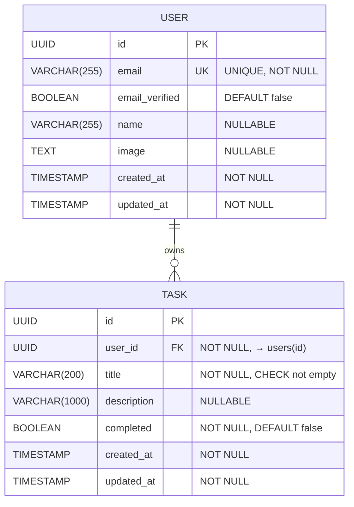

# Data Model: Task CRUD Operations

**Feature**: 001-task-crud | **Date**: 2025-12-12

## Overview

This document defines the data entities, relationships, validation rules, and state transitions for the task management system.

---

## Entities

### 1. User

**Purpose**: Represents an authenticated user who owns tasks.

**Source**: Managed by Better Auth (defined in `/specs/database/schema.md`)

**Attributes**:

| Field | Type | Constraints | Description |
|-------|------|-------------|-------------|
| id | UUID | PRIMARY KEY, NOT NULL | Unique user identifier (auto-generated) |
| email | VARCHAR(255) | UNIQUE, NOT NULL | User's email address for authentication |
| email_verified | BOOLEAN | DEFAULT FALSE | Whether email has been verified |
| name | VARCHAR(255) | NULLABLE | User's display name |
| image | TEXT | NULLABLE | URL to user's profile image |
| created_at | TIMESTAMP WITH TIME ZONE | NOT NULL, DEFAULT NOW() | Account creation timestamp |
| updated_at | TIMESTAMP WITH TIME ZONE | NOT NULL, DEFAULT NOW() | Last update timestamp |

**Validation Rules**:
- Email must be valid email format
- Email must be unique across all users
- Timestamps automatically managed by database

**Indexes**:
- Primary key index on `id`
- Unique index on `email`
- Index on `created_at` for sorting

**Business Rules**:
- Users are created via Better Auth signup flow
- Email verification is tracked but not enforced in Phase 2
- User deletion cascades to all owned tasks

---

### 2. Task

**Purpose**: Represents a todo item owned by a user.

**Source**: Application-specific entity (defined in `/specs/database/schema.md`)

**Attributes**:

| Field | Type | Constraints | Description |
|-------|------|-------------|-------------|
| id | UUID | PRIMARY KEY, NOT NULL | Unique task identifier (auto-generated) |
| user_id | UUID | FOREIGN KEY → users(id), NOT NULL | Owner of this task |
| title | VARCHAR(200) | NOT NULL, CHECK(LENGTH(TRIM(title)) > 0) | Task title/summary |
| description | VARCHAR(1000) | NULLABLE | Optional detailed description |
| completed | BOOLEAN | NOT NULL, DEFAULT FALSE | Completion status |
| created_at | TIMESTAMP WITH TIME ZONE | NOT NULL, DEFAULT NOW() | Task creation timestamp |
| updated_at | TIMESTAMP WITH TIME ZONE | NOT NULL, DEFAULT NOW() | Last update timestamp |

**Validation Rules**:

| Rule | Constraint | Error Message |
|------|-----------|---------------|
| Title required | `NOT NULL` | "Title is required" |
| Title not empty | `CHECK(LENGTH(TRIM(title)) > 0)` | "Title cannot be empty or whitespace only" |
| Title length | `VARCHAR(200)` | "Title must not exceed 200 characters" |
| Description length | `VARCHAR(1000)` | "Description must not exceed 1000 characters" |
| User exists | `FOREIGN KEY` | "Invalid user ID" |

**Indexes**:
- Primary key index on `id`
- Index on `user_id` (for filtering by owner)
- Composite index on `(user_id, completed)` (for filtered queries)
- Index on `created_at DESC` (for sorting)
- Index on `updated_at DESC` (for sorting)
- Composite index on `(user_id, completed, created_at DESC)` (for filtered + sorted queries)

**Foreign Keys**:
- `user_id` → `users(id)` with `ON DELETE CASCADE` and `ON UPDATE CASCADE`

**Business Rules**:
- Every task MUST belong to exactly one user
- Tasks cannot exist without a user
- Title is mandatory and cannot be empty
- Description is optional
- New tasks default to `completed = false`
- Deleting a user deletes all their tasks
- Users can only access their own tasks

---

## Relationships

### User → Task (One-to-Many)

**Cardinality**: 1:N (one user has many tasks)

**Foreign Key**: `tasks.user_id` → `users.id`

**Cascade Behavior**:
- `ON DELETE CASCADE`: Deleting a user deletes all their tasks
- `ON UPDATE CASCADE`: If user.id changes (rare), update all task references

**Business Logic**:
- A user can have 0 to unlimited tasks
- A task MUST belong to exactly one user
- Users cannot see or modify tasks belonging to other users

**Query Pattern**:
```sql
-- Get all tasks for a user
SELECT * FROM tasks WHERE user_id = ? ORDER BY created_at DESC;

-- Get incomplete tasks for a user
SELECT * FROM tasks WHERE user_id = ? AND completed = false;
```

---

## State Transitions

### Task Lifecycle

```
┌─────────────┐
│   Created   │ (completed = false)
└──────┬──────┘
       │
       │ [User clicks "Mark Complete"]
       ▼
┌─────────────┐
│  Completed  │ (completed = true)
└──────┬──────┘
       │
       │ [User clicks "Mark Incomplete"]
       ▼
┌─────────────┐
│ Incomplete  │ (completed = false)
└──────┬──────┘
       │
       │ [User clicks "Delete"]
       ▼
┌─────────────┐
│   Deleted   │ (permanently removed)
└─────────────┘
```

**Valid State Transitions**:

| From State | To State | Trigger | Validation |
|------------|----------|---------|------------|
| Created (incomplete) | Completed | Toggle completion | User owns task |
| Completed | Incomplete | Toggle completion | User owns task |
| Any | Deleted | Delete action | User owns task, confirmation required |
| N/A | Created | Create task | Title not empty, user authenticated |
| Any | Updated | Edit task | User owns task, title not empty |

**State Invariants**:
- `completed` is always `true` or `false` (never NULL)
- `user_id` never changes after creation
- `id` never changes
- `created_at` never changes
- `updated_at` changes on every update

---

## Request/Response Schemas

### TaskCreate (Request)

**Purpose**: Create a new task

```typescript
interface TaskCreate {
  title: string;        // Required, 1-200 chars
  description?: string; // Optional, max 1000 chars
}
```

**Validation**:
- `title`: Required, min 1 char (trimmed), max 200 chars
- `description`: Optional, max 1000 chars

**Example**:
```json
{
  "title": "Buy groceries",
  "description": "Milk, eggs, bread"
}
```

---

### TaskUpdate (Request)

**Purpose**: Update an existing task

```typescript
interface TaskUpdate {
  title?: string;        // Optional, 1-200 chars if provided
  description?: string;  // Optional, max 1000 chars, nullable
  completed?: boolean;   // Optional, toggle status
}
```

**Validation**:
- At least one field must be provided
- `title`: If provided, min 1 char (trimmed), max 200 chars
- `description`: If provided, max 1000 chars, can be null to clear
- `completed`: If provided, must be boolean

**Partial Update**: Only provided fields are updated

**Example**:
```json
{
  "title": "Buy almond milk",
  "completed": false
}
```

---

### TaskResponse (Response)

**Purpose**: Return task data to client

```typescript
interface TaskResponse {
  id: string;              // UUID
  user_id: string;         // UUID
  title: string;
  description: string | null;
  completed: boolean;
  created_at: string;      // ISO 8601 timestamp
  updated_at: string;      // ISO 8601 timestamp
}
```

**Example**:
```json
{
  "id": "550e8400-e29b-41d4-a716-446655440001",
  "user_id": "550e8400-e29b-41d4-a716-446655440000",
  "title": "Complete project documentation",
  "description": "Write comprehensive API documentation for the todo app",
  "completed": false,
  "created_at": "2025-12-10T14:30:00Z",
  "updated_at": "2025-12-10T14:30:00Z"
}
```

---

### DataResponse Wrapper (Response)

**Purpose**: Consistent response structure for all endpoints

```typescript
interface DataResponse<T> {
  data: T;
  meta: {
    timestamp: string;  // ISO 8601
    total?: number;     // For list responses
    limit?: number;     // For paginated responses
    offset?: number;    // For paginated responses
  };
}
```

**Example (Single Task)**:
```json
{
  "data": {
    "id": "550e8400-e29b-41d4-a716-446655440001",
    "user_id": "550e8400-e29b-41d4-a716-446655440000",
    "title": "Buy groceries",
    "description": null,
    "completed": false,
    "created_at": "2025-12-12T10:00:00Z",
    "updated_at": "2025-12-12T10:00:00Z"
  },
  "meta": {
    "timestamp": "2025-12-12T10:05:00Z"
  }
}
```

**Example (Task List)**:
```json
{
  "data": [
    { /* task 1 */ },
    { /* task 2 */ }
  ],
  "meta": {
    "timestamp": "2025-12-12T10:05:00Z",
    "total": 2,
    "limit": 50,
    "offset": 0
  }
}
```

---

### ErrorResponse (Response)

**Purpose**: Consistent error structure

```typescript
interface ErrorResponse {
  error: {
    code: string;
    message: string;
    details?: Record<string, string[]>;
  };
  meta: {
    timestamp: string;
  };
}
```

**Example (Validation Error)**:
```json
{
  "error": {
    "code": "VALIDATION_ERROR",
    "message": "Request validation failed",
    "details": {
      "title": ["Title is required", "Title must be at least 1 character"]
    }
  },
  "meta": {
    "timestamp": "2025-12-12T10:05:00Z"
  }
}
```

---

## Database Constraints Summary

### Primary Keys
- `users.id`: UUID, auto-generated
- `tasks.id`: UUID, auto-generated

### Foreign Keys
- `tasks.user_id` → `users.id` (CASCADE on delete/update)

### Unique Constraints
- `users.email`: Unique across all users

### Check Constraints
- `tasks.title`: `LENGTH(TRIM(title)) > 0` (not empty)

### NOT NULL Constraints
- `users.id`, `users.email`, `users.created_at`, `users.updated_at`
- `tasks.id`, `tasks.user_id`, `tasks.title`, `tasks.completed`, `tasks.created_at`, `tasks.updated_at`

### Default Values
- `users.email_verified`: `false`
- `tasks.completed`: `false`
- All `created_at` fields: `NOW()`
- All `updated_at` fields: `NOW()`

---

## Sample Data

### User
```sql
INSERT INTO users (id, email, email_verified, name, created_at, updated_at)
VALUES (
  '550e8400-e29b-41d4-a716-446655440000',
  'john.doe@example.com',
  true,
  'John Doe',
  '2025-12-01T10:00:00Z',
  '2025-12-01T10:00:00Z'
);
```

### Tasks
```sql
INSERT INTO tasks (id, user_id, title, description, completed, created_at, updated_at)
VALUES
(
  '660e8400-e29b-41d4-a716-446655440001',
  '550e8400-e29b-41d4-a716-446655440000',
  'Buy groceries',
  'Milk, eggs, bread',
  false,
  '2025-12-10T14:30:00Z',
  '2025-12-10T14:30:00Z'
),
(
  '660e8400-e29b-41d4-a716-446655440002',
  '550e8400-e29b-41d4-a716-446655440000',
  'Finish homework',
  null,
  false,
  '2025-12-09T09:15:00Z',
  '2025-12-11T16:45:00Z'
),
(
  '660e8400-e29b-41d4-a716-446655440003',
  '550e8400-e29b-41d4-a716-446655440000',
  'Read book',
  'Chapter 5-7',
  true,
  '2025-12-08T20:00:00Z',
  '2025-12-10T18:30:00Z'
);
```

---

## Entity Diagram (Mermaid)



---

## Performance Considerations

### Index Strategy

**Most Common Queries**:
1. Get all tasks for user: `WHERE user_id = ?` → Index: `idx_tasks_user_id`
2. Get incomplete tasks: `WHERE user_id = ? AND completed = false` → Index: `idx_tasks_user_completed`
3. Get tasks sorted by date: `ORDER BY created_at DESC` → Index: `idx_tasks_created_at`

**Composite Index Benefits**:
- `idx_tasks_user_completed_created`: Covers filtered + sorted queries in one index

**Query Performance**:
- O(log n) for indexed lookups
- O(n) for full table scans (avoided via indexes)
- Target: < 100ms for queries with 10,000+ tasks per user

### Scalability

**Design Supports**:
- 1,000,000+ users
- 100,000,000+ total tasks
- 10,000+ tasks per user
- 100+ concurrent users

**Bottleneck Mitigation**:
- Connection pooling (20-50 connections)
- Index size scales linearly
- Query performance scales logarithmically

---

**Status**: ✅ COMPLETE
**Next**: Generate API contracts in `/contracts/`
